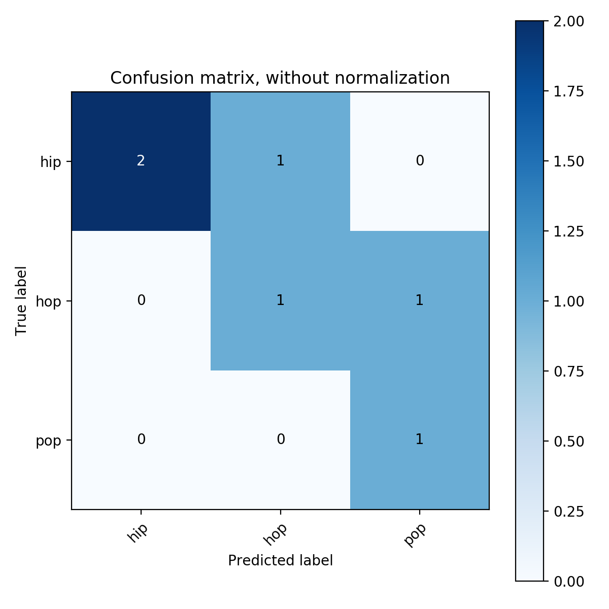

# ddplt

[](https://badge.fury.io/py/ddplt)

A code from my ML projects with a potential of being reusable.


## Confusion matrix

This function prints and plots the confusion matrix.

The code:

```python
import numpy as np
from ddplt.heatmaps import plot_confusion_heatmap

y_test = np.array([0, 0, 1, 1, 2, 0])
y_pred = np.array([0, 1, 1, 2, 2, 0])
class_names = np.array(['hip', 'hop', 'pop'])
ax, cm = plot_confusion_heatmap(y_test, y_pred, class_names)
```

creates a plot like this:



## Learning curve

Create plot showing performance evaluation for different sizes of training data. The method should accept: 
- existing `Axes`
- performance measure (e.g. accuracy, MSE, precision, recall, etc.)
- ...


## ROC curve

Plot showing Receiver Operating Characteristics of a predictor.


## Correlation heatmap

Grid where each square has a color denoting strength of a correlation between predictors. You can choose between Pearson and Spearman correlation coefficient, the result is shown inside the square. 

